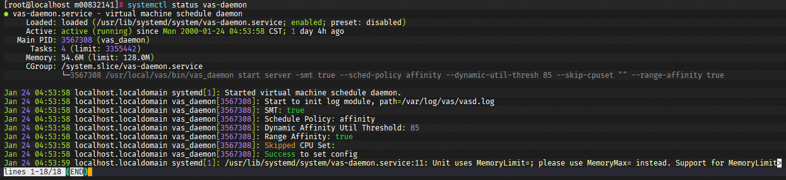

# Virt-awaresched 安装指南

## 拉取源码

```shell
git clone https://gitcode.com/openeuler/ubs-virt.git
# 进入项目目录
cd virt-awaresched
```

## 构建工具链准备

```shell
sudo yum install gcc-c++ gcc cmake make -y
```

## 构建

### 构建依赖

virt-awaresched构建依赖信息已经记录在spec文件（virt-awaresched.spec）中。

具体内容如下：

```shell
Requires: patch libvirt-devel libboundscheck
```

### 安装依赖

yum命令手动安装

```shell
sudo yum install patch libvirt-devel libboundscheck -y
```

### 执行构建

- 执行Release构建（无调试信息），产物输出到项目顶层目录的build/目录下。

    ```shell
    bash build.sh
    ```

- 执行Debug构建（包含调试信息），产物输出到项目顶层目录的build/目录下。

    ```shell
    bash build.sh -D
    ```

## 生成rpm包

构建项目，并打包成RPM文件输出到项目顶层目录下得output/目录下。

```shell
bash build.sh package
```

产物如下：

```filepath
└── output                                                            # 打包输出文件目录
    └── virt-awaresched-1.0.0-1.aarch64.rpm                           # virt-awaresched rpm安装包
```

# 部署指导

---

## 拷贝软件包到部署环境

使用文件传输软件, 将`virt-awaresched-*.*.*-1.aarch64.rpm`软件包上传至服务器。

---

## 安装rpm包

- 首次安装

    ```shell
    rpm -ivh virt-awaresched-*.rpm
    ```

- 覆盖安装

    ```shell
    rpm -ivh --force virt-awaresched-*.rpm
    ```

---

## 确认服务部署状态

```shell
systemctl status vas-daemon
```

出现如下返回信息，说明服务已正常启动。



如果服务启动失败, 请查看服务日志(默认路径: `/var/log/vas/vas.log`), 确认启动失败原因.

---

## 修改启动参数

- 详细请参考[配置说明](#vas-配置说明)
- 重新加载配置

    ```shell
    systemctl daemon-reload
    ```

- 重启服务

    ```shell
    systemctl restart vas-daemon
    ```

---

## vas 配置说明

> vas-daemon服务启动参数, 编辑`/usr/lib/systemd/system/vas-daemon.service`文件中，启动命令行。

| key                  | 说明                                                 | 参数类型      | 合法范围                                                    | 默认值      |
|:---------------------|:---------------------------------------------------|:----------|:--------------------------------------------------------|:---------|
| smt                  | cpu配分配粒度                                           | bool      | <ul><li>true：按照超线程分配。</li><li>false：按照物理核分配。</li></ul>                           | TRUE     |
| sched-policy         | 调度策略                                               | string 枚举 | <ul><li>dynamicAffinity：vcpu动态绑核，依赖内核开启动态绑核特性。</li><li> affinity：静态绑核。</li></ul> | affinity |
| dynamic-util-thresh  | 动态亲和策略的cpu使用率阈值，cpu负载超过阈值，cpu动态绑核                | int       | (0, 100)                                                | 85       |
| skip-cluster-cpumask | 为vcpu分配cpu时将忽略skip-cluster-cpumask对应的cpu所在的Cluster | string    | 支持范围指定, 例如: 0-10 <br /> 支持分段指定: 0-1,2,3-4                     | -       |
| range-affinity       | 重调度的虚拟机，是否包含非numa范围绑核的虚拟机                         | bool      | <ul><li>true: 允许非numa范围绑核的虚拟机参与调度。</li><li>false: 仅允许numa范围绑核的虚拟机参与调度。</li></ul>   | TRUE     |
